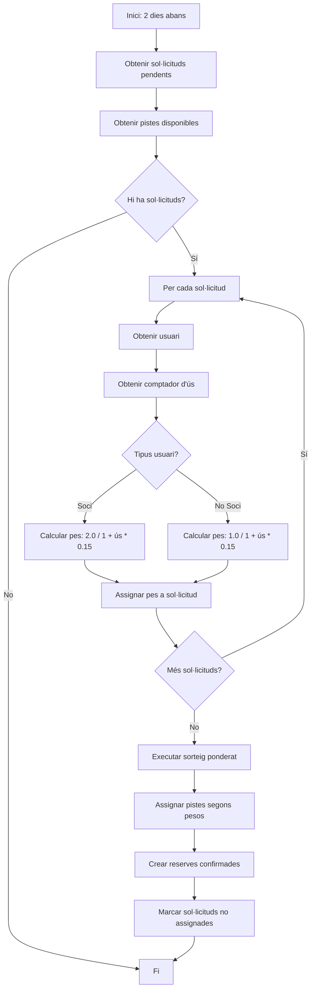
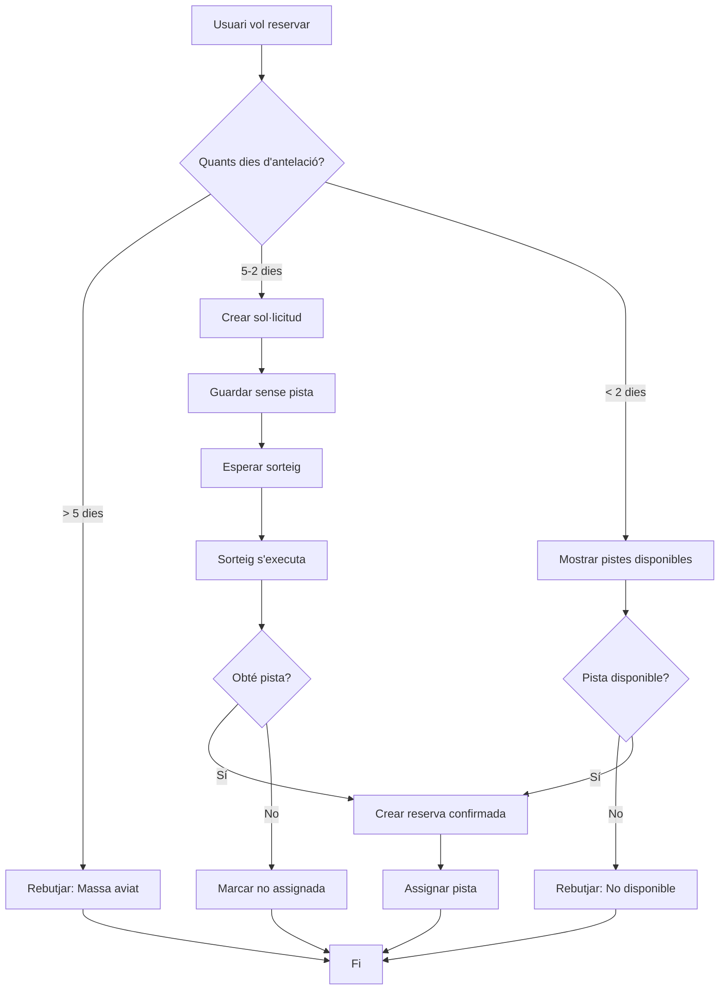

# Document de Disseny

## Visió General

L'aplicació de gestió de reserves de pàdel és un sistema que gestiona reserves amb un model de dues fases: sol·licituds amb sorteig ponderat per a reserves anticipades (5-2 dies) i reserves directes per a última hora (menys de 2 dies). El sistema prioritza socis sobre no socis i penalitza l'ús excessiu mitjançant un comptador que es reinicia mensualment.

### Objectius Principals

- Gestionar sol·licituds i reserves de pistes de pàdel
- Implementar un sistema de sorteig ponderat just que prioritzi socis
- Comptabilitzar l'ús de pistes per usuari amb reset mensual
- Diferenciar entre hora vall i hora punta
- Validar reserves per a 2-4 jugadors
- Proporcionar reserves directes per a última hora

## Arquitectura

### Estil Arquitectònic

El sistema seguirà una arquitectura en capes amb separació clara de responsabilitats:

```
┌─────────────────────────────────────┐
│     Capa de Presentació (UI)       │
│   (Web/Mobile Interface)            │
└─────────────────────────────────────┘
              ↓
┌─────────────────────────────────────┐
│     Capa d'Aplicació (API)          │
│   (Controllers, Services)           │
└─────────────────────────────────────┘
              ↓
┌─────────────────────────────────────┐
│     Capa de Domini (Business Logic) │
│   (Entities, Domain Services)       │
└─────────────────────────────────────┘
              ↓
┌─────────────────────────────────────┐
│     Capa de Persistència            │
│   (Repositories, Database)          │
└─────────────────────────────────────┘
```

### Components Principals

1. **Gestió d'Usuaris**: Autenticació, autorització, tipus d'usuari (Soci/No Soci)
2. **Gestió de Pistes**: CRUD de pistes, estat actiu/inactiu
3. **Gestió d'Horaris**: Configuració de franges horàries, classificació Vall/Punta
4. **Gestió de Sol·licituds**: Creació i gestió de sol·licituds pendents
5. **Motor de Sorteig**: Càlcul de pesos i assignació aleatòria ponderada
6. **Gestió de Reserves**: Creació, consulta i cancel·lació de reserves
7. **Comptador d'Ús**: Seguiment i reset mensual automàtic
8. **Planificador de Tasques**: Execució automàtica del sorteig i reset mensual

## Components i Interfícies

### 1. Gestió d'Usuaris

**Responsabilitats:**
- Registre i autenticació d'usuaris
- Gestió de tipus d'usuari (Soci/No Soci)
- Consulta de comptador d'ús

**Interfície Principal:**
```typescript
interface UserService {
  registerUser(userData: UserRegistrationData): Promise<User>
  getUserById(userId: string): Promise<User>
  updateUserType(userId: string, type: UserType): Promise<User>
  getUserUsageCount(userId: string): Promise<number>
}

enum UserType {
  MEMBER = 'MEMBER',      // Soci
  NON_MEMBER = 'NON_MEMBER'  // No Soci
}
```

### 2. Gestió de Pistes

**Responsabilitats:**
- CRUD de pistes
- Validació d'estat actiu/inactiu
- Verificació de reserves actives abans d'eliminar

**Interfície Principal:**
```typescript
interface CourtService {
  createCourt(courtData: CourtData): Promise<Court>
  updateCourt(courtId: string, courtData: Partial<CourtData>): Promise<Court>
  deactivateCourt(courtId: string): Promise<Court>
  deleteCourt(courtId: string): Promise<void>
  getActiveCourts(): Promise<Court[]>
  hasActiveBookings(courtId: string): Promise<boolean>
}
```

### 3. Gestió d'Horaris

**Responsabilitats:**
- Configuració de franges horàries
- Classificació Hora Vall / Hora Punta
- Aplicació d'horaris per dies de la setmana

**Interfície Principal:**
```typescript
interface ScheduleService {
  createTimeSlot(slotData: TimeSlotData): Promise<TimeSlot>
  updateTimeSlot(slotId: string, slotData: Partial<TimeSlotData>): Promise<TimeSlot>
  getTimeSlotsForDate(date: Date): Promise<TimeSlot[]>
  getTimeSlotsForDayOfWeek(dayOfWeek: number): Promise<TimeSlot[]>
}

enum TimeSlotType {
  OFF_PEAK = 'OFF_PEAK',    // Hora Vall
  PEAK = 'PEAK'             // Hora Punta
}
```

### 4. Gestió de Sol·licituds

**Responsabilitats:**
- Creació de sol·licituds (5-2 dies d'antelació)
- Validació de finestra temporal
- Validació de nombre de jugadors (2-4)
- Consulta de sol·licituds pendents

**Interfície Principal:**
```typescript
interface RequestService {
  createRequest(requestData: BookingRequestData): Promise<BookingRequest>
  cancelRequest(requestId: string): Promise<void>
  getRequestsByUser(userId: string): Promise<BookingRequest[]>
  getPendingRequestsForDate(date: Date, timeSlot: string): Promise<BookingRequest[]>
  validateRequestWindow(date: Date): boolean
}
```

### 5. Motor de Sorteig

**Responsabilitats:**
- Càlcul de pesos d'assignació segons tipus d'usuari i comptador d'ús
- Assignació aleatòria ponderada de pistes
- Actualització d'estat de sol·licituds

**Interfície Principal:**
```typescript
interface LotteryService {
  executeLottery(date: Date, timeSlot: string): Promise<LotteryResult>
  calculateWeight(userType: UserType, usageCount: number): number
  assignCourts(requests: BookingRequest[], availableCourts: Court[]): Promise<Assignment[]>
}

interface LotteryResult {
  assigned: Assignment[]
  unassigned: BookingRequest[]
}

interface Assignment {
  requestId: string
  courtId: string
  bookingId: string
}
```

**Fórmula de Càlcul de Pes:**
```
Per Socis:     pes = 2.0 / (1 + usageCount * 0.15)
Per No Socis:  pes = 1.0 / (1 + usageCount * 0.15)
```

### 6. Gestió de Reserves

**Responsabilitats:**
- Creació de reserves directes (menys de 2 dies)
- Consulta de reserves per usuari
- Cancel·lació de reserves
- Validació de conflictes de doble reserva
- Actualització d'estat (confirmada, cancel·lada, completada)

**Interfície Principal:**
```typescript
interface BookingService {
  createDirectBooking(bookingData: DirectBookingData): Promise<Booking>
  cancelBooking(bookingId: string): Promise<void>
  getBookingsByUser(userId: string): Promise<Booking[]>
  getAvailableCourts(date: Date, timeSlot: string): Promise<Court[]>
  completeBooking(bookingId: string): Promise<void>
  hasConflict(courtId: string, date: Date, timeSlot: string): Promise<boolean>
}

enum BookingStatus {
  REQUESTED = 'REQUESTED',      // Sol·licitada
  CONFIRMED = 'CONFIRMED',      // Confirmada
  CANCELLED = 'CANCELLED',      // Cancel·lada
  COMPLETED = 'COMPLETED'       // Completada
}
```

### 7. Comptador d'Ús

**Responsabilitats:**
- Increment del comptador quan es completa una reserva
- Reset mensual automàtic
- Consulta de comptadors per usuari

**Interfície Principal:**
```typescript
interface UsageCounterService {
  incrementUsage(userId: string): Promise<void>
  getUserUsage(userId: string): Promise<number>
  resetAllCounters(): Promise<void>
  getLastResetDate(): Promise<Date>
}
```

### 8. Planificador de Tasques

**Responsabilitats:**
- Execució automàtica del sorteig 2 dies abans
- Reset mensual de comptadors el dia 1 de cada mes
- Actualització d'estat de reserves completades

**Interfície Principal:**
```typescript
interface SchedulerService {
  scheduleLotteryExecution(date: Date, timeSlot: string): void
  scheduleMonthlyReset(): void
  scheduleBookingCompletion(bookingId: string, completionDate: Date): void
}
```

## Models de Dades

### User (Usuari)
```typescript
interface User {
  id: string
  name: string
  email: string
  type: UserType  // MEMBER o NON_MEMBER
  usageCount: number
  createdAt: Date
  updatedAt: Date
}
```

### Court (Pista)
```typescript
interface Court {
  id: string
  name: string
  description: string
  isActive: boolean
  createdAt: Date
  updatedAt: Date
}
```

### TimeSlot (Franja Horària)
```typescript
interface TimeSlot {
  id: string
  dayOfWeek: number  // 0-6 (Diumenge-Dissabte)
  startTime: string  // Format: "HH:mm"
  endTime: string    // Format: "HH:mm"
  duration: number   // Minuts
  type: TimeSlotType // OFF_PEAK o PEAK
  createdAt: Date
  updatedAt: Date
}
```

### BookingRequest (Sol·licitud de Reserva)
```typescript
interface BookingRequest {
  id: string
  userId: string
  date: Date
  timeSlot: string  // "HH:mm"
  numberOfPlayers: number  // 2-4
  status: BookingStatus
  weight?: number  // Calculat pel motor de sorteig
  createdAt: Date
  updatedAt: Date
}
```

### Booking (Reserva)
```typescript
interface Booking {
  id: string
  userId: string
  courtId: string
  date: Date
  timeSlot: string  // "HH:mm"
  numberOfPlayers: number  // 2-4
  status: BookingStatus
  requestId?: string  // Si ve d'una sol·licitud
  createdAt: Date
  updatedAt: Date
  completedAt?: Date
  cancelledAt?: Date
}
```

### UsageCounter (Comptador d'Ús)
```typescript
interface UsageCounter {
  userId: string
  count: number
  lastResetDate: Date
  updatedAt: Date
}
```

## Propietats de Correcció

*Una propietat és una característica o comportament que ha de mantenir-se cert en totes les execucions vàlides d'un sistema - essencialment, una declaració formal sobre el que el sistema ha de fer. Les propietats serveixen com a pont entre especificacions llegibles per humans i garanties de correcció verificables per màquina.*


### Propietat 1: Persistència del tipus d'usuari
*Per a qualsevol* usuari registrat, recuperar l'usuari del sistema hauria de retornar el mateix tipus (Soci o No Soci) que es va desar durant el registre.
**Valida: Requisits 1.1, 1.2**

### Propietat 2: Actualització del tipus d'usuari
*Per a qualsevol* usuari existent, quan un administrador canvia el seu tipus, totes les operacions futures haurien d'utilitzar el nou tipus per calcular prioritats.
**Valida: Requisits 1.4**

### Propietat 3: Classificació de franges horàries
*Per a qualsevol* franja horària al sistema, ha de tenir una classificació vàlida (Hora Vall o Hora Punta).
**Valida: Requisits 2.1**

### Propietat 4: Comportament segons finestra temporal
*Per a qualsevol* data dins la finestra de sol·licitud (5-2 dies), el sistema hauria de permetre crear sol·licituds sense pista assignada. *Per a qualsevol* data dins la finestra de reserva lliure (menys de 2 dies), el sistema hauria de permetre reserves directes amb pista assignada.
**Valida: Requisits 2.2, 2.3, 6.1**

### Propietat 5: Sol·licituds sense pista assignada
*Per a qualsevol* sol·licitud creada dins la finestra de sol·licitud, la pista assignada hauria de ser null inicialment.
**Valida: Requisits 3.1**

### Propietat 6: Validació del nombre de jugadors
*Per a qualsevol* intent de crear una sol·licitud o reserva, el sistema hauria d'acceptar només nombres de jugadors entre 2 i 4 (inclosos), i rebutjar qualsevol altre valor.
**Valida: Requisits 3.2, 6.3**

### Propietat 7: Round-trip de sol·licituds
*Per a qualsevol* sol·licitud creada, recuperar-la del sistema hauria de retornar les mateixes dades (usuari, data, hora, nombre de jugadors, estat).
**Valida: Requisits 3.4**

### Propietat 8: Acceptació il·limitada de sol·licituds
*Per a qualsevol* franja horària dins la finestra de sol·licitud, el sistema hauria d'acceptar noves sol·licituds independentment del nombre de sol·licituds existents o pistes disponibles.
**Valida: Requisits 3.5**

### Propietat 9: Increment del comptador d'ús
*Per a qualsevol* usuari, quan es completa una reserva, el comptador d'ús hauria d'incrementar-se en exactament 1.
**Valida: Requisits 4.1**

### Propietat 10: Comptador reflecteix reserves completades
*Per a qualsevol* usuari, el comptador d'ús hauria de ser igual al nombre de reserves amb estat COMPLETED des de l'últim reset.
**Valida: Requisits 4.2**

### Propietat 11: Cancel·lació no modifica comptador
*Per a qualsevol* reserva confirmada, cancel·lar-la no hauria de modificar el comptador d'ús de l'usuari.
**Valida: Requisits 4.3, 8.4**

### Propietat 12: Reset mensual de comptadors
*Per a tots* els usuaris, després d'executar el reset mensual, tots els comptadors d'ús haurien de ser 0.
**Valida: Requisits 4.4**

### Propietat 13: Càlcul de pes per socis
*Per a qualsevol* soci amb un comptador d'ús N, el pes d'assignació hauria de ser exactament 2.0 / (1 + N * 0.15).
**Valida: Requisits 5.3**

### Propietat 14: Càlcul de pes per no socis
*Per a qualsevol* no soci amb un comptador d'ús N, el pes d'assignació hauria de ser exactament 1.0 / (1 + N * 0.15).
**Valida: Requisits 5.4**

### Propietat 15: Distribució ponderada del sorteig
*Per a qualsevol* conjunt de sol·licituds amb diferents pesos, executant el sorteig moltes vegades, les sol·licituds amb pesos més alts haurien d'obtenir pista amb més freqüència proporcionalment als seus pesos.
**Valida: Requisits 5.5**

### Propietat 16: Assignació crea reserva confirmada
*Per a qualsevol* sol·licitud que obté pista en el sorteig, hauria de crear-se una reserva amb estat CONFIRMED i amb la pista assignada.
**Valida: Requisits 5.6**

### Propietat 17: Sol·licituds no assignades
*Per a qualsevol* sol·licitud que no obté pista en el sorteig, el seu estat hauria de canviar a no assignada.
**Valida: Requisits 5.7**

### Propietat 18: Reserves directes confirmades immediatament
*Per a qualsevol* reserva directa creada dins la finestra de reserva lliure, l'estat hauria de ser CONFIRMED immediatament.
**Valida: Requisits 6.2**

### Propietat 19: No dobles reserves
*Per a qualsevol* pista i franja horària, no hauria d'existir més d'una reserva confirmada simultàniament.
**Valida: Requisits 6.4, 12.1**

### Propietat 20: Reserves directes sense sorteig
*Per a qualsevol* reserva directa, no hauria de passar pel procés de sorteig ni tenir sol·licitud associada.
**Valida: Requisits 6.5**

### Propietat 21: Consulta de reserves per usuari
*Per a qualsevol* usuari, consultar les seves reserves hauria de retornar totes i només les reserves i sol·licituds on l'usuari és el propietari.
**Valida: Requisits 7.1**

### Propietat 22: Round-trip de reserves
*Per a qualsevol* reserva creada, recuperar-la del sistema hauria de retornar les mateixes dades (pista, data, hora, nombre de jugadors, estat).
**Valida: Requisits 7.2**

### Propietat 23: Estat de sol·licituds pendents
*Per a qualsevol* sol·licitud que no ha passat pel sorteig, l'estat hauria de ser REQUESTED.
**Valida: Requisits 7.3**

### Propietat 24: Cancel·lació elimina del sorteig
*Per a qualsevol* sol·licitud cancel·lada, no hauria d'aparèixer en la llista de sol·licituds pendents per al sorteig.
**Valida: Requisits 8.1**

### Propietat 25: Cancel·lació allibera pista
*Per a qualsevol* reserva confirmada cancel·lada, la pista i franja horària haurien de quedar disponibles immediatament per a noves reserves.
**Valida: Requisits 8.2**

### Propietat 26: Round-trip de pistes
*Per a qualsevol* pista creada, recuperar-la del sistema hauria de retornar les mateixes dades (nom, descripció, estat actiu).
**Valida: Requisits 9.1**

### Propietat 27: Invariant d'identificador de pista
*Per a qualsevol* pista, actualitzar la seva informació no hauria de canviar el seu identificador únic.
**Valida: Requisits 9.2**

### Propietat 28: Pistes inactives no accepten reserves
*Per a qualsevol* pista amb estat inactiu, el sistema hauria de rebutjar intents de crear noves reserves per a aquesta pista.
**Valida: Requisits 9.3**

### Propietat 29: Round-trip de franges horàries
*Per a qualsevol* franja horària creada, recuperar-la del sistema hauria de retornar les mateixes dades (hora inici, hora fi, durada, classificació).
**Valida: Requisits 10.1**

### Propietat 30: Horaris per dia de la setmana
*Per a qualsevol* dues dates amb el mateix dia de la setmana, haurien de tenir les mateixes franges horàries configurades.
**Valida: Requisits 10.2**

### Propietat 31: Validació d'horaris
*Per a qualsevol* franja horària, l'hora de fi hauria de ser estrictament posterior a l'hora d'inici.
**Valida: Requisits 10.4**

### Propietat 32: Immutabilitat de reserves existents
*Per a qualsevol* reserva existent, canviar la configuració de franges horàries no hauria de modificar les dades de la reserva.
**Valida: Requisits 10.5**

### Propietat 33: Integritat referencial
*Per a qualsevol* reserva o sol·licitud, l'usuari i la pista (si està assignada) referenciats haurien d'existir al sistema.
**Valida: Requisits 12.3**

### Propietat 34: Transaccionalitat d'operacions
*Per a qualsevol* operació que falla per validació o error, l'estat del sistema hauria de romandre igual que abans de l'operació.
**Valida: Requisits 12.4**

## Gestió d'Errors

### Errors de Validació

**Validació de Dates:**
- Sol·licituds fora de la finestra de 5-2 dies: `InvalidRequestWindowError`
- Reserves directes fora de la finestra de menys de 2 dies: `InvalidDirectBookingWindowError`

**Validació de Nombre de Jugadors:**
- Nombre de jugadors < 2 o > 4: `InvalidNumberOfPlayersError`

**Validació de Disponibilitat:**
- Intent de reservar pista ja ocupada: `CourtNotAvailableError`
- Intent de reservar pista inactiva: `CourtInactiveError`

**Validació d'Estat:**
- Intent de cancel·lar reserva completada: `CannotCancelCompletedBookingError`
- Intent d'eliminar pista amb reserves actives: `CourtHasActiveBookingsError`

**Validació d'Horaris:**
- Hora de fi anterior o igual a hora d'inici: `InvalidTimeSlotError`

### Errors de Negoci

**Errors de Sorteig:**
- No hi ha pistes disponibles per al sorteig: `NoAvailableCourtsError`

**Errors d'Integritat:**
- Referència a usuari inexistent: `UserNotFoundError`
- Referència a pista inexistent: `CourtNotFoundError`
- Referència a reserva inexistent: `BookingNotFoundError`

### Estratègia de Gestió d'Errors

1. **Validació Primerenca**: Validar totes les dades d'entrada abans de processar operacions
2. **Errors Descriptius**: Proporcionar missatges d'error clars que indiquin què ha fallat i per què
3. **Rollback Transaccional**: En cas d'error durant operacions complexes, revertir tots els canvis
4. **Logging**: Registrar tots els errors per a auditoria i debugging
5. **Errors HTTP Apropiats**:
   - 400 Bad Request: Errors de validació
   - 404 Not Found: Entitats no trobades
   - 409 Conflict: Conflictes de reserves
   - 500 Internal Server Error: Errors inesperats del sistema

## Estratègia de Testing

### Testing Unitari

Els tests unitaris verificaran:
- Lògica de càlcul de pesos d'assignació
- Validacions de dates i finestres temporals
- Validacions de nombre de jugadors
- Lògica d'increment i reset de comptadors
- Validacions d'horaris

**Exemples de tests unitaris:**
```typescript
describe('Weight Calculation', () => {
  test('calculates correct weight for member with 0 usage', () => {
    expect(calculateWeight(UserType.MEMBER, 0)).toBe(2.0)
  })
  
  test('calculates correct weight for non-member with 5 usage', () => {
    expect(calculateWeight(UserType.NON_MEMBER, 5)).toBeCloseTo(0.57, 2)
  })
})

describe('Request Window Validation', () => {
  test('accepts request 3 days in advance', () => {
    const date = addDays(new Date(), 3)
    expect(validateRequestWindow(date)).toBe(true)
  })
  
  test('rejects request 6 days in advance', () => {
    const date = addDays(new Date(), 6)
    expect(validateRequestWindow(date)).toBe(false)
  })
})
```

### Property-Based Testing

El sistema utilitzarà **fast-check** (per a TypeScript/JavaScript) com a llibreria de property-based testing.

**Configuració:**
- Cada test de propietat executarà un mínim de 100 iteracions
- Cada test farà referència explícita a la propietat del document de disseny

**Format d'anotació:**
```typescript
// **Feature: gestio-reserves-padel, Property 1: Persistència del tipus d'usuari**
```

**Exemples de property-based tests:**

```typescript
import fc from 'fast-check'

// **Feature: gestio-reserves-padel, Property 1: Persistència del tipus d'usuari**
test('user type persists after registration', () => {
  fc.assert(
    fc.property(
      fc.record({
        name: fc.string(),
        email: fc.emailAddress(),
        type: fc.constantFrom(UserType.MEMBER, UserType.NON_MEMBER)
      }),
      async (userData) => {
        const user = await userService.registerUser(userData)
        const retrieved = await userService.getUserById(user.id)
        expect(retrieved.type).toBe(userData.type)
      }
    ),
    { numRuns: 100 }
  )
})

// **Feature: gestio-reserves-padel, Property 6: Validació del nombre de jugadors**
test('only accepts 2-4 players', () => {
  fc.assert(
    fc.property(
      fc.integer(),
      (numberOfPlayers) => {
        const isValid = numberOfPlayers >= 2 && numberOfPlayers <= 4
        if (isValid) {
          expect(() => validateNumberOfPlayers(numberOfPlayers)).not.toThrow()
        } else {
          expect(() => validateNumberOfPlayers(numberOfPlayers)).toThrow(InvalidNumberOfPlayersError)
        }
      }
    ),
    { numRuns: 100 }
  )
})

// **Feature: gestio-reserves-padel, Property 13: Càlcul de pes per socis**
test('weight calculation for members follows formula', () => {
  fc.assert(
    fc.property(
      fc.nat(100), // usage count 0-100
      (usageCount) => {
        const weight = calculateWeight(UserType.MEMBER, usageCount)
        const expected = 2.0 / (1 + usageCount * 0.15)
        expect(weight).toBeCloseTo(expected, 10)
      }
    ),
    { numRuns: 100 }
  )
})

// **Feature: gestio-reserves-padel, Property 19: No dobles reserves**
test('no double bookings for same court and time', () => {
  fc.assert(
    fc.property(
      fc.record({
        courtId: fc.uuid(),
        date: fc.date(),
        timeSlot: fc.constantFrom('09:00', '10:00', '11:00'),
        numberOfPlayers: fc.integer({ min: 2, max: 4 })
      }),
      async (bookingData) => {
        // Create first booking
        const booking1 = await bookingService.createDirectBooking({
          ...bookingData,
          userId: 'user1'
        })
        
        // Attempt to create second booking for same court and time
        await expect(
          bookingService.createDirectBooking({
            ...bookingData,
            userId: 'user2'
          })
        ).rejects.toThrow(CourtNotAvailableError)
      }
    ),
    { numRuns: 100 }
  )
})
```

### Tests d'Integració

Els tests d'integració verificaran:
- Flux complet de sol·licitud → sorteig → assignació
- Flux complet de reserva directa
- Flux de cancel·lació i alliberament de pista
- Integració amb base de dades
- Execució del planificador de tasques

### Cobertura de Testing

**Objectiu de cobertura:**
- Cobertura de codi: > 80%
- Cobertura de propietats: 100% (totes les propietats de correcció han de tenir tests)
- Cobertura de casos límit: Tots els edge cases identificats

## Consideracions de Seguretat

### Autenticació i Autorització

- **Autenticació**: Tots els usuaris han d'estar autenticats per accedir al sistema
- **Autorització basada en rols**:
  - Usuaris normals: Poden crear sol·licituds/reserves, veure les seves pròpies reserves, cancel·lar les seves reserves
  - Administradors: Poden gestionar pistes, horaris, modificar tipus d'usuari, veure estadístiques

### Validació de Dades

- Validar totes les entrades d'usuari per prevenir injeccions
- Sanititzar dades abans de desar-les a la base de dades
- Validar tipus de dades i rangs permesos

### Protecció contra Condicions de Carrera

- Utilitzar transaccions de base de dades per operacions crítiques
- Implementar locks optimistes per prevenir dobles reserves
- Utilitzar timestamps per detectar modificacions concurrents

### Auditoria

- Registrar totes les operacions crítiques (creació, modificació, cancel·lació de reserves)
- Mantenir historial de canvis per a auditoria
- Registrar execucions del sorteig amb resultats

## Consideracions de Rendiment

### Optimitzacions de Base de Dades

- **Índexs**:
  - Índex compost en (courtId, date, timeSlot) per a consultes de disponibilitat
  - Índex en userId per a consultes de reserves per usuari
  - Índex en (date, status) per a consultes de sol·licituds pendents

### Càlcul del Sorteig

- Pre-calcular pesos per a totes les sol·licituds abans del sorteig
- Utilitzar algoritmes eficients per a selecció aleatòria ponderada (Alias Method)
- Processar sortejos en lots per a múltiples franges horàries

### Caching

- Cachear configuració d'horaris (canvia poc freqüentment)
- Cachear llista de pistes actives
- Invalidar cache quan es modifiquen dades rellevants

### Escalabilitat

- El sorteig pot executar-se en paral·lel per a diferents dates/franges
- Les consultes de disponibilitat poden utilitzar rèpliques de lectura
- El reset mensual pot processar usuaris en lots

## Tecnologies Recomanades

### Backend
- **Node.js amb TypeScript**: Per a type safety i millor mantenibilitat
- **Express o Fastify**: Framework web lleuger
- **Prisma o TypeORM**: ORM per a gestió de base de dades
- **PostgreSQL**: Base de dades relacional amb suport per transaccions ACID

### Planificador de Tasques
- **node-cron o Bull**: Per a execució de tasques programades (sorteig, reset mensual)

### Testing
- **Jest**: Framework de testing
- **fast-check**: Llibreria de property-based testing
- **Supertest**: Testing d'APIs

### Frontend (Opcional)
- **React o Vue.js**: Framework de UI
- **TailwindCSS**: Estilització
- **React Query o SWR**: Gestió d'estat del servidor

## Diagrama de Flux del Sorteig



## Diagrama de Flux de Reserves



## Pròxims Passos

Després d'aprovar aquest disseny, els següents passos seran:
1. Crear el pla d'implementació amb tasques detallades
2. Configurar l'entorn de desenvolupament
3. Implementar els models de dades i repositoris
4. Implementar la lògica de negoci (serveis)
5. Implementar el motor de sorteig
6. Implementar el planificador de tasques
7. Crear tests unitaris i de propietats
8. Implementar l'API REST
9. Crear la interfície d'usuari
10. Realitzar tests d'integració i end-to-end
